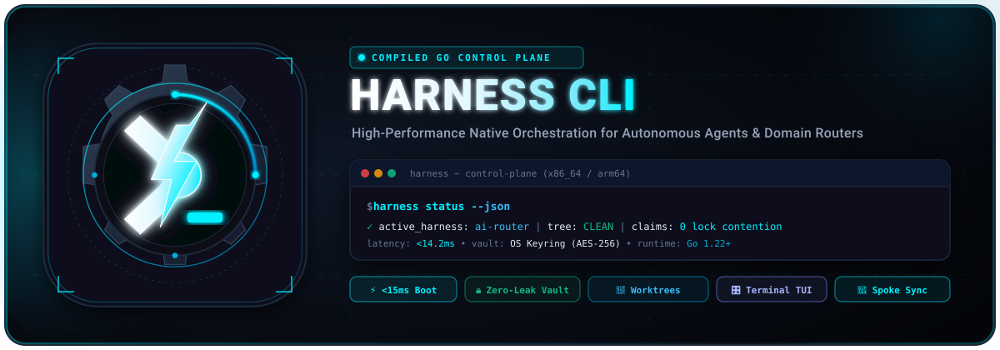
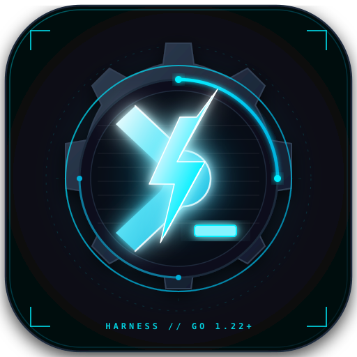
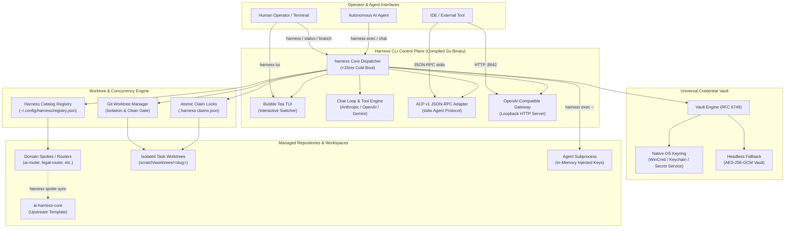

<div align="center">



<br/><br/>



# Harness CLI (`harness`)

**Cross-platform compiled binary control plane for AI agent harnesses, domain routers, and autonomous execution environments.**

[](https://github.com/Koality-Assured/harness-cli/actions/workflows/test.yml)
[](https://github.com/Koality-Assured/harness-cli/actions/workflows/release.yml)
[](https://goreportcard.com/report/github.com/Koality-Assured/harness-cli)
[](go.mod)
[](LICENSE)
[](#architecture)
[](https://conventionalcommits.org)

<br/>

</div>

---

## Mission

`harness` is a zero-dependency, compiled native binary (Go) engineered for high-performance orchestration of AI agent harnesses (`ai-router`, `ai-harness-core`, and specialized domain spokes). 

It replaces interpreter and Python wrapper startup overhead with **sub-15ms cold startups**, guarantees mutual exclusion across concurrent agent worktrees through atomic claim locks, provides zero-leak credential storage via native OS keyrings, exposes an interactive Bubble Tea terminal switcher (TUI), and delivers stdio/HTTP protocol adapters including the Agent Communication Protocol (ACP) and an OpenAI-compatible completion gateway.

### Core Pillars
- **Instantaneous Startup**: Cold startup latency under 15ms (benchmarked against Python interpreter cold starts of ~180–220ms).
- **Automated Worktree Isolation**: Enforces clean working trees, verifies area claim locks, and manages git worktrees via `harness branch`, `harness clean`, and `harness claim`.
- **Zero-Leak Credential Vault**: Direct integration with OS keyrings (Windows Credential Manager, macOS Keychain, Linux Secret Service) with AES-256-GCM encrypted fallback for headless environments; secrets are injected strictly in-memory into child subprocesses.
- **Protocol Adapters (ACP & Gateway)**: Stdio JSON-RPC ACP v1 adapter for agent-to-agent communication and a loopback HTTP OpenAI-compatible chat completion proxy.
- **Dynamic Multi-Harness Switcher**: Interactive Bubble Tea TUI (`harness tui` or `harness`) to discover, inspect, and switch between registered domain harnesses.
- **Dual Output Modes**: Rich ANSI terminal formatting for human operators, and `--json` for machine automation and agent parsing.
- **Multi-Platform Native Binaries**: Precompiled binaries for Windows (`amd64`, `arm64`), macOS (`arm64`, `amd64`), and Linux (`amd64`, `arm64`).

---

## Architecture

The following diagram illustrates how the `harness` CLI acts as the central control plane, bridging human operators, autonomous agent subprocesses, secure credential storage, and isolated git worktrees:



---

## Installation

### Homebrew (macOS / Linux)
```bash
brew tap Koality-Assured/tap
brew install harness
```

### Scoop (Windows)
```powershell
scoop bucket add koality https://github.com/Koality-Assured/scoop-bucket.git
scoop install harness
```

### Go Install
If you have Go 1.22+ installed:
```bash
go install github.com/Koality-Assured/harness-cli/cmd/harness@latest
```

### Standalone Shell Script (macOS / Linux)
```bash
curl -fsSL https://raw.githubusercontent.com/Koality-Assured/harness-cli/main/install.sh | bash
```

### Standalone PowerShell Script (Windows)
```powershell
irm https://raw.githubusercontent.com/Koality-Assured/harness-cli/main/install.ps1 | iex
```

### Prebuilt Binary Releases
Download prebuilt archives for your platform from the [GitHub Releases](https://github.com/Koality-Assured/harness-cli/releases) page:
- `harness_<version>_windows_amd64.zip` / `windows_arm64.zip`
- `harness_<version>_darwin_arm64.tar.gz` / `darwin_amd64.tar.gz`
- `harness_<version>_linux_amd64.tar.gz` / `linux_arm64.tar.gz`

### Building From Source
```bash
git clone https://github.com/Koality-Assured/harness-cli.git
cd harness-cli
go build -ldflags="-s -w" -o harness ./cmd/harness
```

---

## Command Matrix

The table below summarizes the full command matrix supported by `harness`:

| Command | Purpose | Key Flags | Description |
| :--- | :--- | :--- | :--- |
| `harness` | Interactive TUI / Help | `--json`, `--harness` | Launches Bubble Tea TUI in interactive terminals; shows help non-interactively. |
| `harness status` | Repository Status | `--json`, `--harness` | Inspects git branch, working tree cleanliness, and active worktree claims. |
| `harness list` (`ls`) | List Harnesses | `--json` | Lists all registered domain harnesses and live git states. |
| `harness switch <id>` | Switch Default | `--json` | Switches active default harness in the global OS configuration. |
| `harness branch <slug>` | Worktree Isolation | `--areas`, `--agent`, `--type`, `--allow-dirty`, `--branch` | Creates an isolated git worktree with Conventional branch and area claim lock. |
| `harness clean` | Worktree Cleanup | `--merged`, `--stale`, `--stale-hours`, `--slug`, `--auto`, `--all` | Prunes merged worktrees and deletes stale or expired claims. |
| `harness claim inspect` | Claim Inspection | `--all`, `--stale-hours`, `--json` | Audits active claims across harnesses and identifies stale concurrency locks. |
| `harness claim watch` | Claim Watcher Daemon | `--interval`, `--stale-hours`, `--auto-clean` | Continuously monitors harnesses for stale claims and optionally prunes them. |
| `harness exec -- <cmd>` | Subprocess Credential Injection | `--agent`, `--force`, `--dry-run`, `--harness` | Injects provider API keys from vault in-memory into child subprocess. |
| `harness chat` | Conversational Agent | `-q`, `--query-file`, `--provider`, `--model`, `--resume`, `--continue` | Executes one-shot or interactive agent chat with tool execution and slash commands. |
| `harness sessions` | Session Management | `list`, `rename <id> <title>`, `search <query>`, `--json` | Lists, renames, and searches multi-turn agent conversation sessions. |
| `harness commands` | Slash Commands | `--json` | Lists interactive slash commands supported in `harness chat`. |
| `harness gateway` | Completion Gateway | `--host`, `--port`, `--provider`, `--model` | Serves loopback OpenAI-compatible chat completions proxy subset (`:8642`). |
| `harness acp` | ACP v1 JSON-RPC | `--provider`, `--model` | Runs ACP v1 (Agent Communication Protocol) stdio JSON-RPC adapter. |
| `harness auth login` | Credential Vault Login | `[provider]` (`anthropic`, `cursor`, `gemini`, `openai`) | Authenticates and securely persists provider API keys into OS vault. |
| `harness auth status` | Credential Audit | `--json` | Audits stored credentials, token expiration, and active vault backend. |
| `harness auth logout` | Purge Credentials | `[provider]` | Safely purges credentials from the OS keyring and fallback vault. |
| `harness spoke sync` | Spoke Synchronization | `--all`, `--ref`, `--no-fetch`, `--dry-run` | Pulls allowlisted upstream updates from `ai-harness-core` into domain spokes. |
| `harness agent [id]` | Agent Inspection | `--json`, `--harness` | Inspects available agents and prompt specifications in active harness. |
| `harness register <path>`| Register Repository | `--json` | Registers a local repository checkout as a domain harness in the catalog. |
| `harness deregister <id>`| Deregister Repository | `--json` | Removes a domain harness from the local catalog. |
| `harness scan [dir]` | Auto-Scan Sibling Repos | `--json` | Discovers sibling repositories matching router markers and registers them. |
| `harness tui` | Terminal Switcher | `--harness` | Launches fullscreen interactive Bubble Tea domain switcher. |
| `harness pr` | Pull Request Gate | `--base`, `--title`, `--body`, `--draft`, `--dry-run` | Validates Conventional Commits across branch and opens GitHub PR via `gh`. |

---

## Detailed Usage Guides

### 1. Worktree Isolation & Claim Locks
When multiple autonomous agents or developers work concurrently on the same codebase, `harness` eliminates branch collisions and file conflicts:

```bash
# Create an isolated worktree for the 'auth-refactor' task claiming the 'internal' area
harness branch auth-refactor --areas internal --agent specialist-auth --type feat

# Inspect active claims and concurrency locks
harness claim inspect

# Prune merged worktrees and clean up expired claims
harness clean --merged
```

### 2. Zero-Leak Credential Injection
Instead of storing API keys in unencrypted `.env` files or system environment variables, store them once in the OS keyring and inject them strictly into subprocess memory:

```bash
# Log in with Anthropic, OpenAI, or Gemini credentials
harness auth login anthropic

# Execute an agent runner or command with keys injected in-memory only
harness exec -- go test ./...
harness exec --agent code-specialist -- python -m my_agent.run
```

### 3. Agent Communication Protocol (ACP) & Gateway
Connect IDEs and external tools directly to your local domain harnesses:

```bash
# Start the loopback OpenAI-compatible chat completion gateway on port 8642
export HARNESS_GATEWAY_API_KEY="sk-harness-local-secret"
harness gateway --port 8642 --provider anthropic

# Run ACP v1 stdio JSON-RPC adapter for agent orchestration
harness acp --provider anthropic --model claude-3-7-sonnet
```

### 4. Interactive Domain Harness TUI
Switch between multiple domain harnesses with an interactive terminal switcher:

```bash
harness tui
# Use arrow keys or j/k to navigate, Enter to activate, q to quit
```

---

## Shell Ergonomics & Profile Integration

`harness` provides native shell autocompletion for subcommands, flags, and arguments across PowerShell, Bash, Zsh, and Fish.

### PowerShell Profile Integration
Add autocompletion loading to your PowerShell profile (`notepad $PROFILE`):
```powershell
if (Get-Command harness -ErrorAction SilentlyContinue) {
    harness completion powershell | Out-String | Invoke-Expression
}
```

### Bash Integration
```bash
# Add to ~/.bashrc
source <(harness completion bash)
```

### Zsh Integration
```zsh
# Add to ~/.zshrc
source <(harness completion zsh)
```

### Fish Integration
```fish
# Add to ~/.config/fish/config.fish
harness completion fish | source
```

---

## Development & Testing

### Running Tests
Run the complete unit and integration test suite across all packages:
```bash
go test -v ./...
```

Run race condition detection and static verification:
```bash
go test -v -race ./...
go vet ./...
```

### Compiling Binaries
Build optimized release binaries with stripped symbols and debug information:
```bash
go build -ldflags="-s -w" -o harness ./cmd/harness
```

---

## License

MIT License. Copyright (c) 2026 Koality-Assured. See [LICENSE](LICENSE) for details.
